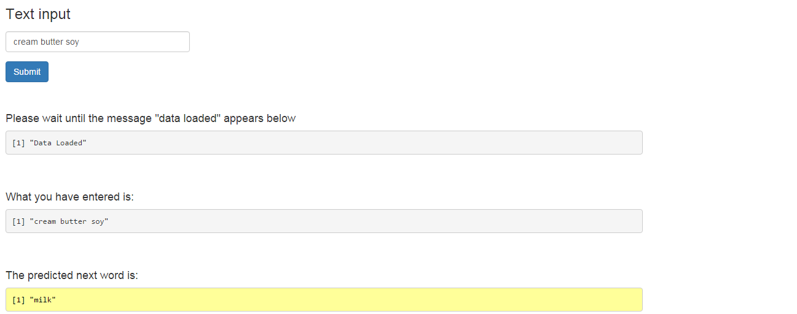

Coursera Data Science Capstone Presentation
========================================================
author: Joel Lee
date: Jan 2016

This application is done for the capstone course for the Coursera Data Science Specialization.

Capstone Outcome
========================================================

The purpose of this project is to create a prediction algorithm in order 
to predict what the next word would be. 

This would be done through 
an app which would take in a phrase in a text box input and output
a prediction of the next word.  

There are 3 data sets that are used to train the prediction algorithm:
- News Data set
- Blogs Data set
- Twitter Data set

Pre-Processing of Data
========================================================
The blogs and news data set was about 200mb and the twitter data set was about 163mb.
A sampling of 100,000 rows was taken from each of the 3 data sets in order to form the corpus.

The following was done on the data set:
- Words were all transfored to lower case
- Punctuation and stopwords (most common words in the language) were removed
- Words were stemmed and whitespaces removed

A list of bigram (2 words), trigram (3 words) and 4-gram (4 words) words were generated from the
corpus of data

Application
========================================================

The application predicts the next word by using an n-gram backoff technique. It starts off by 
searching the 4-gram model for the next word, failing which it searches the trigram model and the
bigram model for the next word. 

Conclusion
========================================================
The application can be accessed at https://joellee.shinyapps.io/capstoneproject/

The codes that were used to build this application can be found at https://github.com/joelllee/datasciencecapstone

This deck of slides can be found at http://rpubs.com/joelllee/capstoneproject

